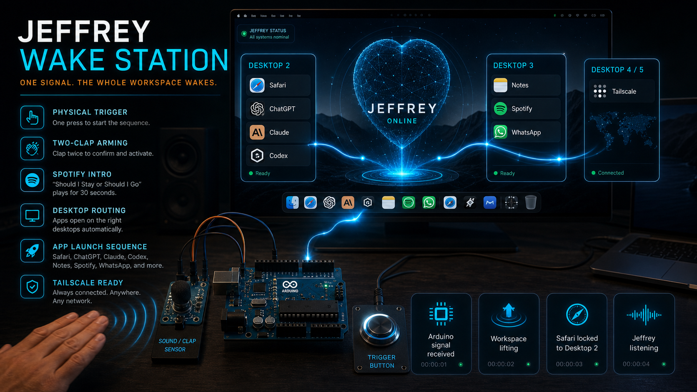

# Jeffrey Wake Station



Physical control station that maps room events to complete macOS routines.

## Real implementation

```text
PIR + sound sensor + physical button
                    ↓
               Arduino MEGA
                    ↓ USB serial
             Mac listener service
                    ↓
            AppleScript routines
```

After threshold, debounce and cooldown tuning, measured end to end latency stayed under 200 ms.

## Inputs

PIR handles presence. The sound sensor detects a tuned clap threshold. The button provides a deliberate override. The Arduino emits readable serial events so hardware behavior is easy to inspect.

## Mac bridge

`mac/wake_listener.py` keeps the serial connection open and maps each event to a named AppleScript routine. Sensing stays in the microcontroller; system intent stays on the Mac.

## Run

Upload `arduino/WakeStation.ino` to an Arduino MEGA and adapt the pin constants. Then:

```bash
python3 -m venv .venv
source .venv/bin/activate
pip install -r requirements.txt
python mac/wake_listener.py --port /dev/cu.usbmodemXXXX
```

Adapt the scripts in `mac/routines` to your apps and workspace.

## CA

Estació física amb Arduino MEGA, PIR, sensor de so i botó que envia esdeveniments per sèrie a un servei del Mac i executa rutines AppleScript en menys de 200 ms.

## ES

Estación física con Arduino MEGA, PIR, sensor de sonido y botón que envía eventos por serial a un servicio del Mac y ejecuta rutinas AppleScript en menos de 200 ms.
